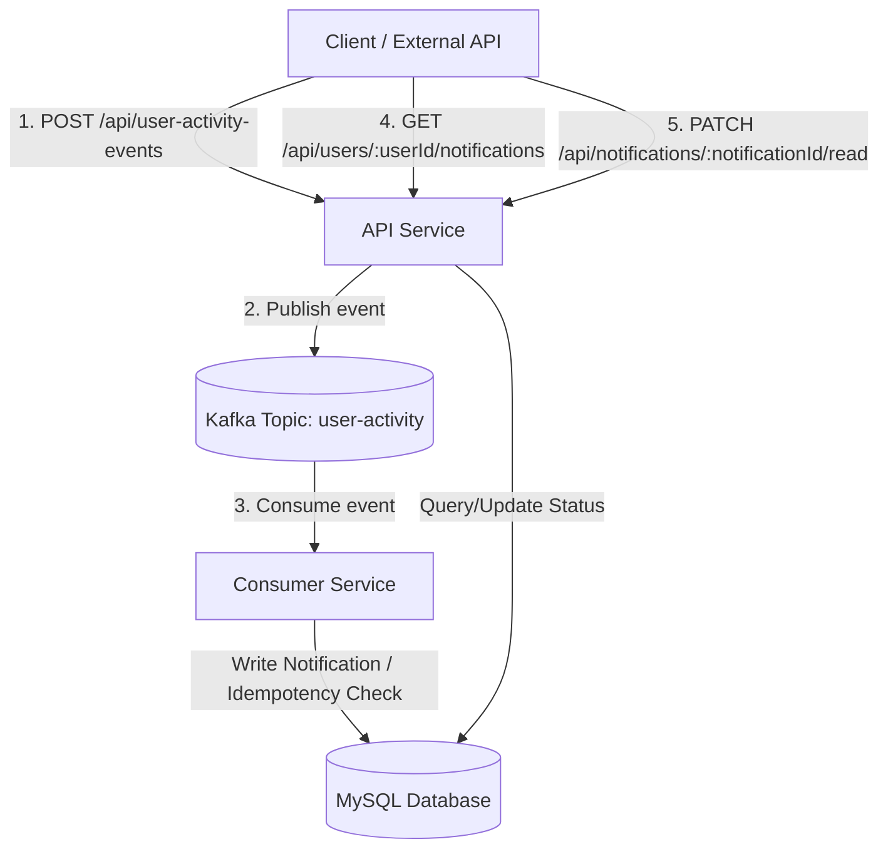

# Architectural Overview - Event-Driven Notification System

This document details the architectural decisions, design choices, data flow, idempotency strategy, and resilience policies implemented in the Event-Driven Notification System.

## Architectural Diagram



---

## 1. Core Components

### A. API Service (Publisher)
- **Role**: Serves client requests and translates user actions into immutable facts (events).
- **Stack**: Node.js, Express, TypeScript.
- **Responsibilities**:
  - Validates API request payloads using `Zod` validation schemas.
  - Generates message metadata, including a unique `event_id` and a UTC `timestamp`.
  - Publishes normalized event payloads to the `user-activity` topic in Apache Kafka.
  - Exposes REST endpoints to query and update stored notifications directly from MySQL.

### B. Kafka Broker (Message Streaming)
- **Role**: Serves as the distributed, fault-tolerant message pipeline.
- **Stack**: Apache Kafka (Confluent Community distribution) + ZooKeeper.
- **Configuration**:
  - Messages are routed to partitions using the recipient's user ID as the routing key (`key` in KafkaJS message properties). This guarantees that all events intended for a specific user are processed sequentially (maintaining strict ordering), even when multiple partitions are active.

### C. Consumer Service (Processor)
- **Role**: Processes user-activity events asynchronously and generates target notifications.
- **Stack**: Node.js, TypeScript.
- **Responsibilities**:
  - Subscribes to the `user-activity` topic as part of the `notification-consumer-group`.
  - Parses and validates consumed events.
  - Generates descriptive notification texts.
  - Persists notifications to MySQL while enforcing idempotency.

### D. MySQL Database (Persistence)
- **Role**: Relational store for notifications.
- **Schema Design**: Includes unique keys, timestamps, indexes for recipient-specific state filtering (`idx_recipient_user_id_status`).

---

## 2. Event Flow & Message Formats

### A. Publish Lifecycle
1. The client issues a `POST /api/user-activity-events` request.
2. The API Service validates fields. Both `recipient_id` and `liked_by_user_id` are mapped dynamically to standard Kafka payloads.
3. The event message is structured and published.

**Published Kafka Schema Example:**
```json
{
  "event_id": "a8b9f30e-5612-42da-9f3c-1b601e3b2e59",
  "timestamp": "2026-06-20T00:30:15.123Z",
  "source": "api-service",
  "event_type": "user_liked_post",
  "payload": {
    "user_id": "liker-user-123",
    "target_id": "post-xyz-456",
    "recipient_id": "post-owner-789"
  }
}
```

### B. Consumption Lifecycle
1. The Consumer Service pulls the message from Kafka.
2. It parses the JSON and generates a formatted message:
   - `user_liked_post` -> `"Your post was liked by liker-user-123."`
   - `user_commented` -> `"Your post received a comment from commenter-user-123: nice photo!"`
3. It performs a database `INSERT`. If the database signals that this event is a duplicate, the consumer discards it and acknowledges the offset.

---

## 3. Idempotency Strategy

In a distributed environment, network failures or consumer rebalances can cause duplicate message delivery (At-Least-Once delivery model). Without idempotency, duplicate deliveries result in duplicate notifications (e.g. telling a user multiple times that someone liked their post).

### Database-Level Deduplication
Our idempotency mechanism relies on the MySQL schema:
- The `notifications` table defines a `processed_event_id VARCHAR(36) UNIQUE NOT NULL` column.
- When inserting a notification record, the original `event_id` is written to `processed_event_id` in the same transaction block.
- **Duplicate Detection**: If a message with an already-processed `event_id` is retried, the `INSERT` statement violates the `UNIQUE` index constraint, causing MySQL to return error code `1062` (`ER_DUP_ENTRY`).
- **Resilience**: The consumer service catches error `1062`, writes a warning to the logs, and completes the handler successfully **without throwing an error**. This tells the Kafka broker to commit the offset and avoid further retries of this message.

---

## 4. Resilience and Error Handling

### A. Validation Boundaries
- Invalid request payloads submitted to the API service are rejected immediately at the gateway with a `400 Bad Request` before entering the Kafka pipeline.
- If a malformed message is read by the consumer service, the Zod parser identifies the issue and logs the event format error. The consumer ignores the message rather than crashing or throwing, preventing a poison-pill message from blocking the consumer queue.

### B. Database / Network Failures
- If the database is temporarily unreachable, the consumer service catches the query failure and **rethrows** the error.
- Re-throwing the error prevents the message offset from being committed, prompting KafkaJS to retry processing the event batch after a backing-off interval.

### C. Dead-Letter Queue (DLQ) Considerations
While not implemented in this phase, a production implementation would direct persistently failing events to a DLQ topic (e.g. `user-activity-dlq`) after a specified number of failed retry attempts (e.g., 5). This allows operations to inspect corrupted event data without stopping the primary consumption pipeline.

---

## 5. Architectural Trade-Offs

| Decision | Trade-off / Rationale |
| :--- | :--- |
| **Kafka Routing Key** | Partitioning messages by the `recipient_id` ensures ordering. If a user receives multiple comments on a post, the notifications arrive and are processed in the correct temporal order. |
| **DB UNIQUE Constraint Idempotency** | Utilizing MySQL unique keys simplifies code and guarantees absolute deduplication at the database write layer, avoiding complex, race-condition-prone checks inside the application code. |
| **Express Connection Pooling** | The `mysql2` package manages a pool of 10 connections. This handles rapid queries concurrently while protecting database limits during spikes in API requests. |
