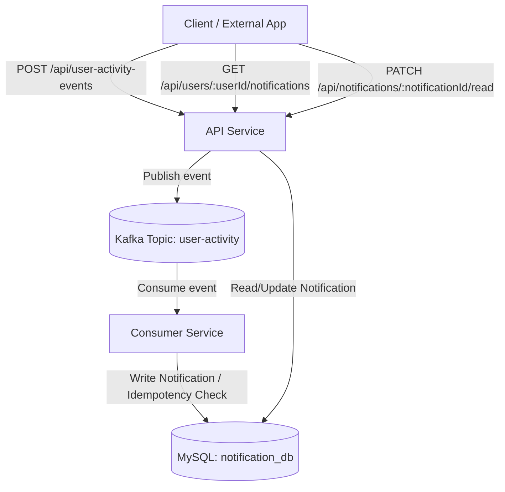

# Event-Driven Notification Service

A robust, decoupled, and scalable real-time notification system built with **Event-Driven Architecture (EDA)** utilizing **Apache Kafka**, **Node.js (TypeScript/Express)**, and **MySQL**.

The system ingests user activities (such as likes or comments) via a REST API, streams the events through Kafka, processes them asynchronously, and writes notification records to MySQL with strict **exactly-once (idempotent)** processing semantics.

---

## Architecture Overview



For a detailed review of design choices, data schemas, and reliability strategies, refer to the [ARCHITECTURE.md](ARCHITECTURE.md) document.

---

## Features

- **RESTful Event Publisher**: Validates incoming events via Zod schemas and publishes to Kafka.
- **Asynchronous Consumer**: Consumes messages and processes them out-of-band to prevent bottlenecking.
- **Strict Idempotency**: Employs a database UNIQUE key constraint (`processed_event_id`) to enforce exactly-once delivery guarantees.
- **Graceful Shutdown**: Shuts down connections and servers clean of memory leaks.
- **Complete Orchestration**: Uses Docker Compose for seamless single-command environments setup.
- **Robust Integration & Unit Tests**: Verified via isolated Jest test suites.

---

## Technology Stack

- **Runtime**: Node.js (v18+)
- **Language**: TypeScript
- **Framework**: Express.js
- **Streaming Pipeline**: Apache Kafka + ZooKeeper
- **Database**: MySQL 8.0
- **Validation**: Zod
- **Testing**: Jest + Supertest
- **Logging**: Winston Structured Loggers

---

## Getting Started

### Prerequisites
- [Docker](https://www.docker.com/products/docker-desktop/) (and Docker Compose v2.0+)

### Setup Environment
1. Clone the repository and navigate into the folder:
   ```bash
   cd Event-Driven-Notification-Service-with-Apache-Kafka
   ```

2. Generate the `.env` file from the example template:
   ```bash
   cp .env.example .env
   ```
   *(The default `.env` credentials work out-of-the-box for local orchestration).*

---

## Running the Application

Spin up the entire system (ZooKeeper, Kafka, MySQL, API Service, and Consumer Service) in detached mode using Docker Compose:

```bash
docker-compose up --build -d
```

### Verifying Service Health
To check the status of running containers:
```bash
docker-compose ps
```

To view application logs in real-time:
```bash
# View API service logs
docker-compose logs -f api-service

# View Consumer service logs
docker-compose logs -f consumer-service
```

---

## API Documentation

### 1. Publish User Activity Event
Receives a user activity event and publishes it to the Kafka stream.

- **Endpoint**: `POST /api/user-activity-events`
- **Headers**: `Content-Type: application/json`
- **Request Body (Like Event)**:
  ```json
  {
    "event_type": "user_liked_post",
    "payload": {
      "user_id": "test-liker-id",
      "post_id": "test-post-id",
      "liked_by_user_id": "test-owner-id"
    }
  }
  ```
  *(Note: The `payload` schema also supports `recipient_id` for flexibility).*
- **Request Body (Comment Event)**:
  ```json
  {
    "event_type": "user_commented",
    "payload": {
      "user_id": "test-commenter-id",
      "post_id": "test-post-id",
      "comment_text": "Beautiful picture!",
      "recipient_id": "test-owner-id"
    }
  }
  ```
- **Success Response**: `202 Accepted`
  ```json
  {
    "message": "Event published successfully",
    "event_id": "848d56bb-ca0f-48d6-950c-e2f476a26df1"
  }
  ```

---

### 2. Get User Notifications
Retrieves all **unread** notifications for a specific user, ordered by creation date descending.

- **Endpoint**: `GET /api/users/{userId}/notifications`
- **Path Parameters**: `userId` (Unique ID of the recipient user)
- **Success Response**: `200 OK`
  ```json
  [
    {
      "notification_id": "49bfd02f-2d7c-47bc-ad6c-d2c67cf75f3a",
      "recipient_user_id": "test-owner-id",
      "event_type": "user_liked_post",
      "message_content": "Your post was liked by test-liker-id.",
      "status": "unread",
      "created_at": "2026-06-20T00:35:45.000Z"
    }
  ]
  ```

---

### 3. Mark Notification as Read
Updates the status of a specific notification to `read`.

- **Endpoint**: `PATCH /api/notifications/{notificationId}/read`
- **Path Parameters**: `notificationId` (Unique UUID of the notification)
- **Success Response**: `204 No Content`
- **Error Response**: `404 Not Found` (if notification does not exist)

---

## Schemas

### Kafka Message Schema (Topic: `user-activity`)
```json
{
  "event_id": "uuid-unique-for-this-event-instance",
  "timestamp": "ISO 8601 UTC string",
  "source": "api-service",
  "event_type": "user_liked_post | user_commented",
  "payload": {
    "user_id": "uuid-of-actor",
    "target_id": "uuid-of-target-entity",
    "recipient_id": "uuid-of-user-to-notify",
    "comment_text": "string (only for comments)"
  }
}
```

### Database Schema (MySQL: `notifications` table)
```sql
CREATE TABLE IF NOT EXISTS notifications (
    notification_id VARCHAR(36) PRIMARY KEY,
    recipient_user_id VARCHAR(36) NOT NULL,
    event_type VARCHAR(50) NOT NULL,
    message_content TEXT NOT NULL,
    status ENUM('unread', 'read') DEFAULT 'unread',
    created_at TIMESTAMP DEFAULT CURRENT_TIMESTAMP,
    processed_event_id VARCHAR(36) UNIQUE NOT NULL
);

-- Index for performant querying of user unread lists
CREATE INDEX idx_recipient_user_id_status ON notifications (recipient_user_id, status);
```

---

## Testing

### Running Automated Tests
Run unit and integration test suites directly inside the docker containers:

```bash
# Execute API tests
docker-compose exec api-service npm test

# Execute Consumer tests
docker-compose exec consumer-service npm test
```

### Manual E2E Testing Flow (curl)

Follow this sequence to test full integration manually:

1. **Publish a Liked Event**:
   ```bash
   curl -X POST http://localhost:3000/api/user-activity-events \
     -H "Content-Type: application/json" \
     -d '{"event_type": "user_liked_post", "payload": {"user_id": "alice-10", "post_id": "post-20", "recipient_id": "bob-30"}}'
   ```
   *Expected Response:* `202 Accepted` along with a generated `"event_id"`.

2. **Retrieve Notifications**:
   ```bash
   curl -X GET http://localhost:3000/api/users/bob-30/notifications
   ```
   *Expected Response:* `200 OK` listing the unread notification message: `"Your post was liked by alice-10."`. Copy the `"notification_id"` returned.

3. **Verify Idempotency**:
   Trigger the exact same publish command or query logs to confirm duplicate `event_id` processing is skipped. The notification list for `bob-30` should still contain only one entry.

4. **Mark Read**:
   ```bash
   # Replace <notification_id> with the UUID from step 2
   curl -X PATCH http://localhost:3000/api/notifications/<notification_id>/read
   ```
   *Expected Response:* `204 No Content`.

5. **Retrieve Notifications Again**:
   ```bash
   curl -X GET http://localhost:3000/api/users/bob-30/notifications
   ```
   *Expected Response:* `200 OK` with an empty array `[]` (since notifications are now read).